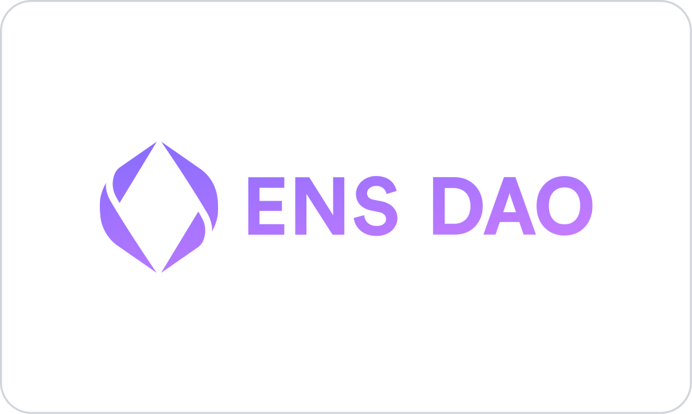
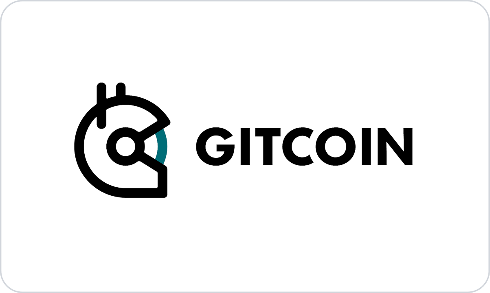

# ENSNode

> ENSNode is the multichain indexer for ENSv2.

Full Documentation ➡︎ [ensnode.io](https://ensnode.io)

ENSNode is the new multichain indexer for [ENS](https://ens.domains/) and [ENSv2](https://roadmap.ens.domains/roadmap/). It provides enhanced ENS indexing capabilities beyond the ENS Subgraph, including faster indexing and simpler deployments. Initial multichain capabilities include indexing mainnet, Basenames, and Linea, providing a unified multichain namespace in a subgraph-compatible GraphQL api. When indexing just mainnet, it has full data equivalency with the ENS Subgraph.

- Multichain ENS Namespace
  - flattened, unified, multichain and multiregistrar namespace via optional plugins
  - ✅ Mainnet ENS Names
  - ✅ Basenames (`.base.eth`)
  - ✅ Linea Names (`.linea.eth`)
  - 🚧 + more
- Built on Ponder
  - ✅ Rapid Indexing & Backfill
    - 10x faster than ENS Subgraph
    - Mainnet Backfill: **7 hours** on M1 Macbook
  - ✅ More efficient than ENS Subgraph
    - 35x less disk space and 35% fewer RPC credits [[source]](https://ponder.sh/docs/why-ponder)
  - ✅ End-to-end type safety
  - ✅ Automatically reconciles chain reorganizations
  - ✅ Deploy anywhere with Node.js & Docker
- Designed for web developers
  - ✅ [use ENSNode with ENSjs](https://www.ensnode.io/ensnode/usage/with-ensjs/)
  - ✅ [GraphQL APIs](https://ensnode.io/ensnode/usage/api/)
  - ✅ [Live Queries & React Hooks](https://ponder.sh/docs/query/client)
  - ✅ Custom APIs for your app
- [1:1 Subgraph Compatibility](https://www.ensnode.io/ensnode/reference/subgraph-compatibility/)
  - ✅ [100% data equivalency](https://github.com/namehash/ens-subgraph-transition-tools) as compared to Subgraph
  - ✅ 100% ensjs test suites passing via [ens-test-env](https://github.com/namehash/ens-test-env)
  - 🚧 100% ens-app-v3 test suites passing via [ens-test-env](https://github.com/namehash/ens-test-env)
- Own your ENSNode index
  - ✅ [Deploy ENSNode to your own cloud](https://ensnode.io/ensnode/deploying/) for controlling your own uptime guarantees and private queries

## Why Index ENS? Why ENSNode?

The ENS protocol enables resolution of names across multiple chains and even off-chain data sources. ENS smart contracts optimize for some operations, but not others. For example, if you wanted to list all of a user's owned names, there's no practical way to do this through ENS contracts.

An indexer aggregates and reorganizes the representation of ENS's state to make many important queries like that possible, efficient, and convenient:

```graphql
# get all of a user's domains by address
query Domains($adress: String!) {
  domains(where: { owner: $address }) {
    id
    name
    ...
  }
}
```

Historically the ENS Subgraph has served this purpose, but the Subgraph's limitations are increasingly severe as the ENS protocol grows. For example: The ENS Subgraph can only index a single chain at a time (ex: mainnet). Given how the majority of ENS names are now issued off of mainnet, only a small percentage of ENS names can be indexed by the ENS Subgraph. This issue will only grow more severe with the launch of ENSv2 and Namechain.

ENSNode is a modern, multichain indexer for ENS. It supports backwards-compatible Subgraph queries and sets the stage for supporting [ENSv2](https://roadmap.ens.domains/roadmap/), in particular Namechain and the growing set of off-chain ENS names (like `.uni.eth` and `.cb.id`).

## Documentation

Documentation for the ENSNode suite of apps is available at [ensnode.io](https://ensnode.io).

## Contributions

We welcome community contributions and feedback—please see [CONTRIBUTING.md](CONTRIBUTING.md) for more information.

## Sponsors

NameHash has received generous support from the [ENS DAO](https://ensdao.org/) and [Gitcoin](https://www.gitcoin.co/).

<p align="middle">
  <a href="https://ensdao.org/" target="_blank" width="100">
    
  </a>
  <a href="https://www.gitcoin.co/" target="_blank" width="100">
    
  </a>
</p>

## Contact Us

Visit our [website](https://namehashlabs.org/) to get in contact.

## License

Licensed under the MIT License, Copyright © 2025-present [NameHash Labs](https://namehashlabs.org).

See [LICENSE](./LICENSE) for more information.

## Repo Overview

The ENSNode monorepo contains multiple modules in the following subdirectories:

- [`apps`](apps) executable applications.
- [`packages`](packages) for libraries that can be embedded into apps.
- [`docs`](docs) documentation sites.

### [`apps/ensnode`](apps/ensnode)

The main ENSNode indexer application enabling multichain indexing for ENS.

### [`apps/ensrainbow`](apps/ensrainbow)

A sidecar service for healing ENS labels. It provides a simple API to recover labels from their hashes. This optimizes a number of ENS use cases, including indexing of ENS data. See the [ENSRainbow documentation](apps/ensrainbow/README.md) for more details.

## Packages

### [`packages/ens-deployments`](packages/ens-deployments)

Convenient catalog of ENS deployments including chain, contract addresses, start blocks, and event filters.

### [`packages/ensrainbow-sdk`](packages/ensrainbow-sdk)

TypeScript library for interacting with the [ENSRainbow API](apps/ensrainbow).

### [`packages/ensnode-utils`](packages/ensnode-utils)

Common utilities used across ENSNode applications

### [`packages/ponder-schema`](packages/ponder-schema)

Shared Ponder schema definitions

### [`packages/ponder-subgraph-api`](packages/ponder-subgraph-api)

Subgraph API compatibility layer

### [`packages/shared-configs`](packages/shared-configs)

Shared configuration files

## Docs

### [`docs/ensnode`](docs/ensnode.io/)

Astro/Starlight documentation app for ENSNode and ENSRainbow.

### [`docs/ensrainbow`](docs/ensrainbow.io/)

Landing page for ENSRainbow.
